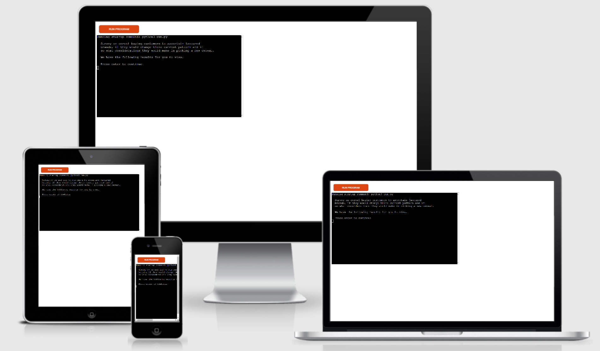

# Cornflake Test

## Python Essentials Project

The application is designed to return insights on survey result carried out on the current cereal customers buying habits.

### [View the live application on Heroku](https://cereal-survey.herokuapp.com/)

## Table of contents

- [UX](#UX)
    - [Business goals](#Business-goals)
    - [User goals](#User-goals)
- [Features](#Features)
- [Technology](#Technology)
- [Testing](#Testing)
    - [Code Validation](#Code-validation)
    - [Issues found during testing](#Issues-found-during-testing)
    - [Performance testing](#Performance-testing)
- [Deployment](#Deployment)
- [Credits](#Credits)
- [Screenshots](#Screenshots)

# UX

## Business goals

A survey of 3 questions was carried out on 20 cereal buying customers. The purpose of the survey is to see if there is potential room for a new brand to enter this market.

The questions asked were;

1. Which of the following brands do you buy?

Answer options were;

a) Kellogs 
b) Nestle 
c) Quaker 
d) Other brands 

2. Would you consider changing to a different cereal in the future?

Answer options were;

a) Yes 
b) No 

3. What do you consider when picking a new cereal?

Answer options were;

a) Price 
b) Packaging 
c) Box Size 
d) Healthier Option 

## User goals

The application is designed to give the user a recap of the question asked and then followed by some actionable insights based on the answers.

The user can then move onto the next question when they are ready to do so by pressing 'Enter'.

# Features

The application is a command line application.

There has been spacing added to help breakdown some of the text to make it easier for the user to absorb the information.

[Return to the table of contents](#table-of-contents)

# Technology

### Python

- The back end of the application is written in Python.

### HTML

- The HTML part of the application was developed by the Code Institute.

### CSS

- The CSS part of the application was developed by the Code Institute.

### Heroku

- Where the site is hosted.

### Google Sheets

- Where the data (answers from teh survey) are stored

### Github

- Where the repository for the app is stored.

### Gitpod

- Where the application was developed.

# Testing

## Code validation

The code was tested using pep8online.com with no errors or warnings.

### Issues found during testing

When the app was deployed on Heroku, i didn't like that there was no padding betweent the forst character of the text in each line and the edge of the command line window. So 2 spaces were input to each text line, to help the user to follow the text.

### Performance testing

To check the user feedback to the data collected, the data was changed to test for accurate outcomes. There were a couple of errors found early on, for example if 100% of people would try a new cereal the app missed this as still gave a positive outcome (i.e. There is room for a new cereal).

These were modified an no further errors were found.

# Deployment

The application has been deployed on Heroku. In order to do this I carried out the following actions;

1. Click new

2. Click create new app

3. Entered the app name, confirmed my region and then pressed 'create app'. Note: The app name must be uique on Heroku

4. Then clicked on 'settings' and created some 'config vars' - these are files / connection data that Heroku will use to build the app, but will not keep secure.

5. Added 2 buildpacks - Python and node.js

6. Clicked 'deploy' and then connected to Github by clicking on GitHub and following the instructions to find the repository.

7. Then scrolled down and clicked on manual deployment. This builds the app and shows the steps it is taking to do so.

8. Finally I clicked the view app button to test the deployment of the app and test run the app on Heroku.

# Credits

This app was heavily influenced by the Love Sandwiches project. A lot of the code was taken and then modified from that project.

There were a couple of other areas where I got ideas for code to be used in this app;

w3schools.com
tutorialsteacher.com/python
stackoverflow.com

Although no code was directly lifted from these sites, I certainly did modify some code I found on there for my own needs in building this site.

# Screenshots

